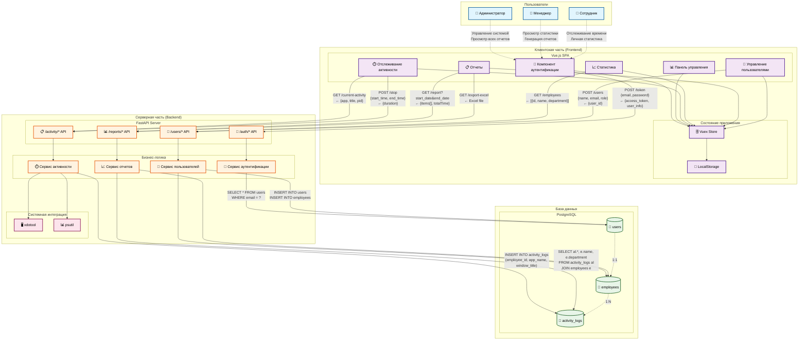

# Верхнеуровневая архитектура системы учета рабочего времени



## Детализация взаимодействий

### 1. Пользователь → Клиентская часть

#### Администратор
- **Отправляет**: Учетные данные, команды управления пользователями
- **Получает**: Полный доступ ко всем функциям, отчеты по всем сотрудникам

#### Менеджер  
- **Отправляет**: Запросы на статистику, параметры отчетов
- **Получает**: Статистика по отделу, сводные отчеты

#### Сотрудник
- **Отправляет**: Команды старт/стоп отслеживания
- **Получает**: Личная статистика, текущая активность

### 2. Клиентская часть → Серверная часть

#### Аутентификация
```http
POST /token
Content-Type: application/x-www-form-urlencoded

username=user@company.com&password=password123

Response:
{
  "access_token": "eyJ0eXAiOiJKV1QiLCJhbGciOiJIUzI1NiJ9...",
  "token_type": "bearer"
}
```

#### Отслеживание активности
```http
GET /current-activity
Authorization: Bearer <token>

Response:
{
  "app": "VS Code",
  "title": "main.py - employee-tracker",
  "pid": 1234
}
```

```http
POST /stop
Authorization: Bearer <token>
Content-Type: application/json

{
  "start_time": "2024-01-15T09:00:00Z",
  "end_time": "2024-01-15T17:30:00Z"
}

Response:
{
  "message": "Workday completed",
  "duration_seconds": 30600,
  "duration_human": "8h 30m"
}
```

#### Генерация отчетов
```http
GET /report?start_date=2024-01-01&end_date=2024-01-31&department=Разработка
Authorization: Bearer <token>

Response:
{
  "items": [
    {
      "employeeId": 1,
      "employeeName": "Иван Петров",
      "department": "Разработка",
      "totalTime": 2400,
      "apps": {
        "VS Code": 1800,
        "Chrome": 600
      }
    }
  ],
  "totalDepartmentTime": 2400,
  "averageEmployeeTime": 2400
}
```

#### Экспорт Excel
```http
GET /export-excel?start_date=2024-01-01&end_date=2024-01-31
Authorization: Bearer <token>

Response: Binary Excel file
Content-Type: application/vnd.openxmlformats-officedocument.spreadsheetml.sheet
```

#### Управление пользователями
```http
POST /users
Authorization: Bearer <token>
Content-Type: application/json

{
  "name": "Новый Сотрудник",
  "email": "new@company.com",
  "password": "password123",
  "role": "EMPLOYEE",
  "department": "Разработка"
}

Response:
{
  "message": "User created successfully",
  "user_id": 123
}
```

### 3. Серверная часть → База данных

#### Аутентификация пользователя
```sql
-- Поиск пользователя по email
SELECT id, email, name, role, department, password_hash 
FROM users 
WHERE email = 'user@company.com';
```

#### Создание пользователя
```sql
-- Создание пользователя
INSERT INTO users (email, name, role, department, password_hash) 
VALUES ('new@company.com', 'Новый Сотрудник', 'EMPLOYEE', 'Разработка', '$2b$12$...');

-- Создание профиля сотрудника
INSERT INTO employees (user_id, name, department) 
VALUES (123, 'Новый Сотрудник', 'Разработка');
```

#### Логирование активности
```sql
-- Запись активности
INSERT INTO activity_logs (employee_id, window_title, app_name, start_time) 
VALUES (1, 'main.py - employee-tracker', 'VS Code', '2024-01-15 09:00:00');

-- Завершение активности
UPDATE activity_logs 
SET end_time = '2024-01-15 09:30:00' 
WHERE id = 456 AND end_time IS NULL;
```

#### Генерация отчетов
```sql
-- Получение данных для отчета
SELECT 
    al.employee_id,
    e.name as employee_name,
    e.department,
    al.app_name,
    SUM(EXTRACT(EPOCH FROM (al.end_time - al.start_time))/60) as duration_minutes
FROM activity_logs al
JOIN employees e ON al.employee_id = e.id
WHERE al.start_time >= '2024-01-01' 
  AND al.start_time <= '2024-01-31'
  AND al.end_time IS NOT NULL
GROUP BY al.employee_id, e.name, e.department, al.app_name;
```

### 4. Серверная часть → Системные API

#### Получение информации об активном окне
```python
# Получение ID активного окна
active_window_id = subprocess.check_output(['xdotool', 'getactivewindow'])

# Получение заголовка окна
window_title = subprocess.check_output(['xdotool', 'getwindowname', active_window_id])

# Получение PID процесса
pid = subprocess.check_output(['xdotool', 'getwindowpid', active_window_id])

# Получение информации о процессе
process = psutil.Process(int(pid))
app_name = process.name()
```

## Потоки данных

### Поток аутентификации
1. **Пользователь** → вводит email/пароль → **Frontend**
2. **Frontend** → POST /token → **Backend**
3. **Backend** → SELECT users → **Database**
4. **Database** → user data → **Backend**
5. **Backend** → JWT token → **Frontend**
6. **Frontend** → сохранение в LocalStorage → **Пользователь**

### Поток отслеживания активности
1. **Пользователь** → нажимает "Начать отслеживание" → **Frontend**
2. **Frontend** → GET /current-activity → **Backend**
3. **Backend** → xdotool/psutil → **Система**
4. **Система** → window info → **Backend**
5. **Backend** → INSERT activity_logs → **Database**
6. **Backend** → activity data → **Frontend**
7. **Frontend** → отображение активности → **Пользователь**

### Поток генерации отчетов
1. **Пользователь** → выбирает параметры отчета → **Frontend**
2. **Frontend** → GET /report → **Backend**
3. **Backend** → SELECT с JOIN → **Database**
4. **Database** → aggregated data → **Backend**
5. **Backend** → processed report → **Frontend**
6. **Frontend** → отображение таблицы → **Пользователь**
7. **Пользователь** → запрос Excel → **Frontend**
8. **Frontend** → GET /export-excel → **Backend**
9. **Backend** → Excel file → **Frontend**
10. **Frontend** → скачивание файла → **Пользователь**